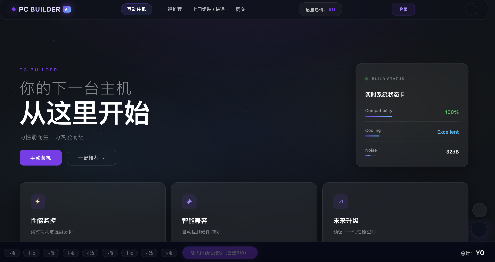
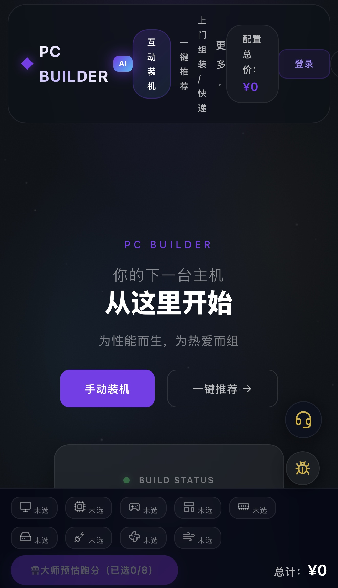

# AI PC Builder｜AI驱动的电脑配置推荐网站

一个面向电脑装机小白的 AI 驱动 PC 配置推荐网站。

用户只需输入预算与使用需求，即可快速获得兼容性均衡、高性价比的台式电脑配置方案，降低硬件选择与装机决策门槛。

---

# 在线体验（Live Demo）

项目地址：
https://miao0-o.github.io/pc-builder/recommend.html

GitHub Repo：
https://github.com/Miao0-o/pc-builder

---

# 项目背景（Project Background）

作为电脑装机新手，我在尝试配置第一台台式电脑时发现：

- 各类硬件型号复杂
- 配件兼容性难理解
- 学习成本高
- 很容易踩坑
- 很难以合理价格搭配出适合自己的电脑

目前大多数装机网站与工具：
- 更偏向“教用户学习硬件”
- 或面向已有基础的玩家用户
- 对真正的小白并不友好

用户通常需要：
- 自己研究 CPU / GPU 差异
- 学习主板兼容性
- 理解电源功耗
- 查看大量论坛与教程

整体决策过程复杂且耗时。

因此，我希望设计一个：

“像购买笔记本电脑一样简单”的装机推荐工具。

用户只需要：
- 输入预算
- 选择使用场景

即可快速获得：
- 兼容性合理
- 性价比均衡
- 面向真实需求

的整机配置方案。

同时配合简化版硬件科普内容，帮助用户在低学习成本下理解核心硬件概念，提高自主选择能力。

---

# 项目目标（Project Goals）

本项目重点关注：

- 降低电脑装机门槛
- 优化小白用户决策体验
- 提高信息浏览效率
- 简化硬件选择流程
- 提供更现代化、更轻量化的网页体验
- 探索 AI-assisted workflow 下的快速产品开发方式

---

# 核心功能（Features）

## 1. 一键式电脑配置推荐

用户输入：
- 预算
- 使用需求

即可快速获得对应电脑配置方案。

适用场景包括：
- 游戏
- 学习办公
- 内容创作
- 高性能需求

---

## 2. 小白友好的信息展示

通过：
- 卡片式布局
- 极简化视觉设计
- 清晰的信息层级

降低用户的信息压力与阅读负担。

---

## 3. 简易硬件科普

针对：
- CPU
- GPU
- 内存
- 主板
- 电源

等核心硬件提供简化说明。

帮助用户：
- 理解核心概念
- 降低学习门槛
- 提升自主选择能力

---

## 4. 响应式网页设计

适配：
- Desktop
- Tablet
- Mobile

提升不同设备下的浏览体验。

---

# AI协同开发流程（AI-assisted Workflow）

本项目采用 AI 协同开发（AI-assisted development）工作流完成。

开发过程中主要结合：
- Claude Code
- vibe coding workflow

进行快速产品原型开发与页面迭代。

## AI主要参与：

- 前端页面结构生成
- UI原型快速搭建
- 布局与组件实验
- 页面迭代优化
- 设计方向探索

---

## 人工主导部分：

- 用户痛点分析
- 产品定位
- 信息架构设计
- UX优化
- 页面交互逻辑
- 视觉风格统一
- 内容组织与产品决策

本项目重点并非“完全由AI生成代码”，而是：

探索 Human-AI Collaboration（人机协同开发）在产品快速原型与用户体验设计中的应用。

---

# 设计思考（Design Decisions）

## 信息浏览效率优化

减少视觉噪音，提高用户快速扫描能力。

---

## 极简化视觉风格

统一：
- 图标风格
- 页面配色
- 卡片组件

提升整体一致性与现代感。

---

## 小白友好的交互逻辑

避免：
- 复杂参数
- 专业术语堆叠
- 高学习成本操作

优先保证：
- 易理解
- 易浏览
- 易决策

---

## 卡片式布局

通过模块化卡片设计：
- 提升配置对比效率
- 增强页面可读性
- 优化内容组织结构

---

# 技术栈（Tech Stack）

- HTML
- CSS
- JavaScript
- GitHub Pages
- Claude Code
- AI-assisted development workflow

---

# 项目结构（Project Structure）

```txt
pc-builder/
├── assets/                # 项目截图与资源文件
├── css/                   # 样式文件
├── js/                    # 页面交互逻辑
├── index.html             # 首页
├── recommend.html         # 推荐页面
├── README.md
└── LICENSE
```
---

# 项目截图（Preview）

**首页**



**推荐页面**


**移动端页面**



---

# 后续优化方向（Future Improvements）

未来计划继续优化：
更智能的配置推荐逻辑
实时价格获取
AI聊天式装机推荐
配件兼容性自动检测
用户偏好系统
收藏与分享功能
